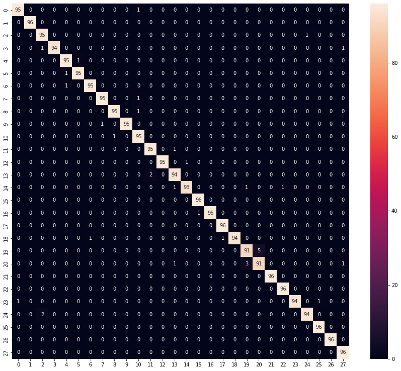

# Arabic Handwritten Character Recognition Project

## Contents
<ul> 
  <li>Data</li>
  <li>Model</li>
  <li>Installation</li>
  <li>Results</li>
</ul>
 
## Data
The data is images of arabic characters written by hand and there is a folder for images and csv file for labels


## Model
The model is simple and consists of number of convolution layers and pooling then fully connected layers before the prediction layer with softmax activation function

## Installation
You should have torch and torchvision

To pull the repository on your machine
```
git clone https://github.com/EhabIbrahim758/Arabic-Handwritten-Characters.git
```

## Results
This is the confusion matrix for all classes on test data



